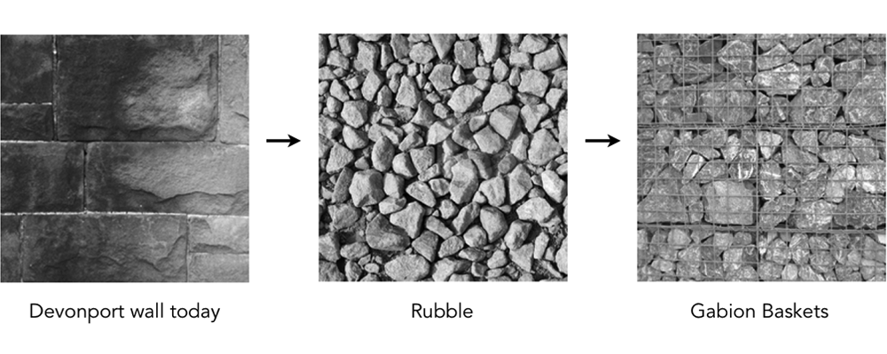

In a small district of Plymouth, known as Devonport there can be found a wall. A dreary edifice of soulless brick bisecting the community and hindering passage. The merciful council has sounded a decree of destruction for the blighted barrier.

 

The task bestowed upon us is to utilise the remaining crumbs of scree to generate an outdoor learning habitat situated in the locally found 'Devonport High-school for Boys'. This vestibule of academia must include 'an augmented interface for people to interact and participate'.

We were to work alongside the architects and design a interactive learning experience inside of the experimental learning space they were assigned to create. There was a lot of discussion.

### Tenses

Our initial idea would involve the residents of Devonport storing their memories of the wall along with historical context   in the form of text, pictures, video or audio. The memories and information would be sub-categorised into: before the wall existed, during it's reign and after it's fall. 

These could be submitted to a web interface and would be dynamically combined into a persistent visualisation viewable in the outdoor teaching area. The visualisation would be projected around the inside of the the teaching area along with coloured lighting that would match and alter the mood.

We decided the visualisation was too passive, the children would probably find it uninteresting after multiple visits and the content would be too static. Very few new memories would be added after the wall was gone. 

Potentially the children could add their own thoughts or memories to the wall, forming something like a time capsule for the different years in the school that would evolve and change over time.

### Bricks

In search of interactivity we came upon the idea of fashioning parts of the existing wall into miniature bricks for use in the installation. These bricks could be said to contain specific memories that would be displayed, or rather greater concepts that were less definable but would still clearly effect the visualisation.

A version of the design involved a small scale model of the wall built out of the miniature bricks. There would be sections of the wall missing and extra blocks that were able to slot into the gaps. Fitting in the various bricks in the different slots would alter the visualisation.

Another potential idea was to have many bricks that could be used to build small structures as a kind of game. There would be an floor pad or pedestal surface that would detect the bricks currently on the area and those would be the ones to effect the display. 

### Rubble

After being thrown into a classroom full of children without warning we discovered that they barely knew anything about Devonport let alone the wall itself. We decided that the wall, while important to the history of Devonport, should not be the sole focus of the classroom. Instead we turned to the reuse aspect of the project; turning something most despised into something fresh, new and useful.  

The architects had decided that an interesting way to reuse the rubble of the wall would be as filling for gabion baskets. These baskets are generally filled with debris and used as foundations. Usually hidden or obscured, these huge cubes could be an important outward feature of the classroom. They would showcase and symbolise the reuse of materials for positive gain.

Continuing on the theme of reuse we chose to use the learning area as a combined whole to educate about the direct and long term effects of recycling and energy conservation. 

### Detection

Our final idea was to integrate the entire school with a system of sensors that would measure many values including heat, light, water use and human presence. These values would all feed back to a central server that would collate and analyse. 

The live and historic data would be accessible as dry statistics via a web interface. This would include graphs and tables showing the improvement or otherwise in the different areas the system was monitoring.

The data would also be fed into a larger interactive visualisation found in the outdoor teaching area. This display would act as a sort of living representation of the school, similar to a virtual pet or pets.

The objective would be to improve the 'green' level of the school by turing off lights, keeping doors shut, not wasting water etc. The live data would help be specific and scientific but the visualisation would be much more engaging and hopefully draw the kids into caring about the school. 

Based on the current levels of various sensors the pets could for example shiver if a door was left open. Other possible states would also be based on the emotions of the school and how it feels about its pupils failing or succeeding to be more green.

### Prototype

To demonstrate this concept we created a prototype version that consisted of wireless heat and light sensors reporting to a server that in turn distributed this data to both a dry data graph and a visualisation.

Each sensor had its own Arduino board with a stacked XBee wireless module. The XBee's communicated to a master Arduino that then connects via WiFly to the Server. The server distributes the data via web sockets to the any open clients running the graph or the visualisation.

The graph is made in paper.js, a framework for animation in HTML5 canvas. This allows the graph to be viewed on almost any modern platform such as the school computers or the pupil's smart phones. 

The visualisation is made in processing and will react dynamically to the data. It features little cubes that will dance in the dark, explode in excessive heat or shiver in the cold. Also the overall colour will change based on the relative heat.

<iframe width="708" height="398" src="http://www.youtube.com/embed/16BzrPirW4o?rel=0" frameborder="0" allowfullscreen></iframe>
