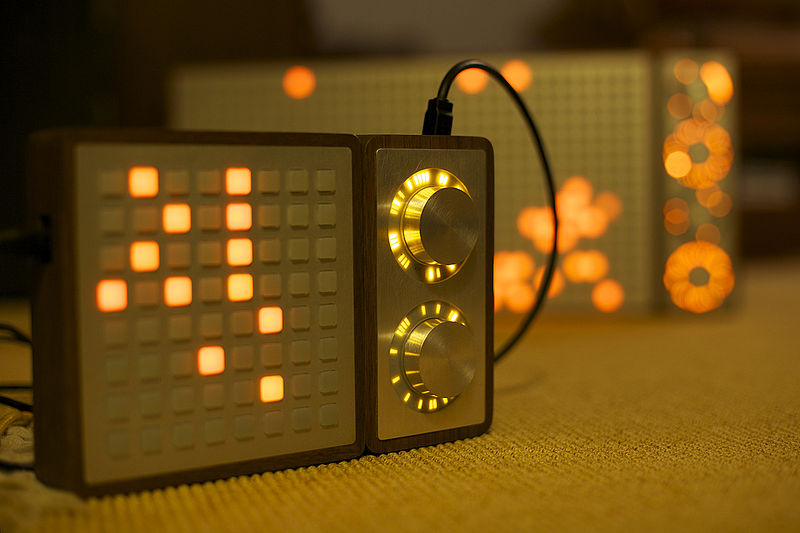

Situated betwixt planes of Cornish farmland is the small town of St. Blazey. We along with the architects were given the brief of producing a building containing ubiquitous technologies that would specifically focus on one of the cultural-industrial, social or environmental cultural heritage areas. 	 

 

### Connections

We decided to focus on the social aspect of the brief and attempt to re-kindle lost connections or forge new bonds. The town used to be an important part of the greater Cornwall area, the importance of the industry gave people purpose, jobs and community. 

As the utility of the local industry waned so did this spirit of the town itself. We wanted to alter St. Blazey to simultaneously create a reason for people to visit and also create a link that would remind the surrounding areas about it's existence.

St. Blazey is neighboured by the towns of Fowey and St Austell. St. Austell is a lively and attractive town with a world famous brewery and Fowey is a picturesque fishing village. Residents of St. Blazey find they are having to visit these towns to work or go to school rather than staying local. This dislocation and lack of community leaves the town feeling hollow.

 

We obviously don't have the power to rejuvenate the economy, community and industry of a fading town. But the proposed Archive building and subsequently the installation within could at least create some kind of connection.

### Distribution

Very early on we hit on the idea of a distributed installation that could spark interest and possibly cause people to visit St. Blazey. The concept is to have multiple installations distributed at at various sites, yet they somehow interact with each other in real-time. This can allow a tangible form of connection without using more transparent methods like direct sound or video links. 

A main interactive object would be set up inside or around the building designed by the architects. This primary object would connect to similar objects found in St. Austell and Fowey. Each object would display the interactions happening to itself and to its siblings simultaneously. 

### Harmonisation

We wanted the interaction to be something everyone could participate in, something simple but enjoyable. The one thing that kept appearing in discussion was music. Music is something nearly everyone can appreciate with almost no explanation required. Music can also cause strong emotional responses so seemed perfect for our purposes.

Quickly we realised that playing music with people across Cornwall could be a really cool experience, however we needed an instrument that was easy to pick up but deep enough to be interesting and engaging. Simply having a pile of instruments would present such a barrier of skill as to destroy the original intent.

### Matrices 

After many ideas involving holding hands, touching poles and even brushing against dangling tree roots to make music we settled on a ['tone matrix'](http://tonematrix.audiotool.com/). This fantastically simple form of 'instrument' consist of a grid of cells that are either enabled or disabled. The cells that are enabled will produce a tone when a repeating play head sweeps over them. In most examples the time component is on the x-axis with the pitch altering on the y-axis. Because of the consistent rhythm and limited tonal range they make simple rhythms very easy to create.

 

[Monome](http://monome.org), a company from Pennsylvania produces beautifully hand-crafted computer-interface devices with programmable LED backlit buttons. These can be used for anything you wish, but are perfect for hooking up to the logic of a tone matrix. To turn one of these into an installation we decided to super-size it and integrate it into the building itself. 

### Destinations

Our final design was to produce a huge multi-person monome. 
On top of having this giant floor sequencer it would be synchronised with two more of its kind in the town centres of St. Austell and Fowey. Placing it in the floor was chosen to increase the fun of interaction and also improve the potential for accidental discovery in the auxiliary locations. To emphasise the different locations, each will be given a unique tonal range. 

 

The hope is that pedestrians walking through the busy town centres of St. Austell and Fowey might walk across the monome producing light and sound. They can have fun using it to make music and, assuming the other locations were also busy, would notice that not all of the notes are their own. Everything being perfect people using all three monomes simultaneously could create more complex music using the differing tones available.

Back in St. Blazey the monome would be a central feature of the proposed building. To emphasise this location there would also be an archive room that alters according to the use of the monome. The floor would be formed from a layer of pliable material stretched over pistons arrayed in a grid to match the buttons of the monome. The pistons would expand and contract in relation to the historical data of the monome use. the most used  and disused keys would raise or lower the most. This would create a physically interactive representation of the history of the music itself.

Talking about interesting technologies that would be possible to include in this system we came across fiberoptic laced concrete that would be perfect for the illuminating floor panels. Also the speakers used to produce the sounds would be fitted with reflecting domes to minimise the sound heard from outside of the area itself.

### Prototypical

Given the time-scale of this project and the complexity of producing a working physical monome we decided to create a digital version. We set up two web based monomes produced using javascript and a 3D model created in Unity. These would all talk to a node.js server that relayed any changes and kept them all in sync. The sound was produced from scratch using the HTML5 Web Audio API oscillators rather than using pre-recorded sounds.

<iframe width="708" height="398" src="http://www.youtube.com/embed/2gUvwj4tp0A?rel=0" frameborder="0" allowfullscreen></iframe>

The architects also produced a physical model of the archive room floor.

