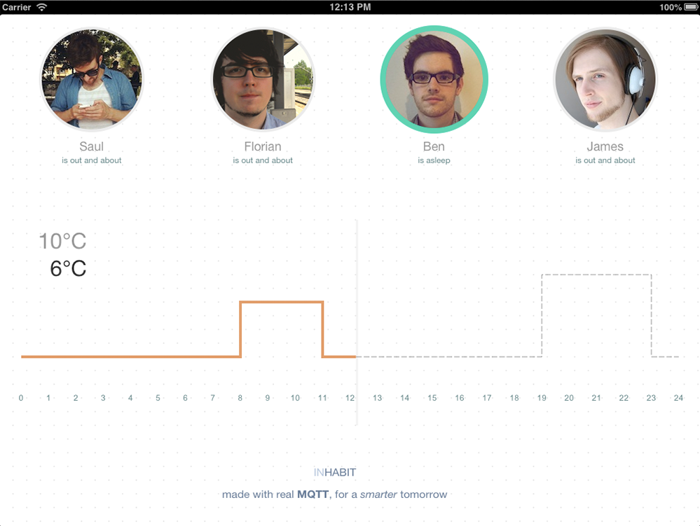
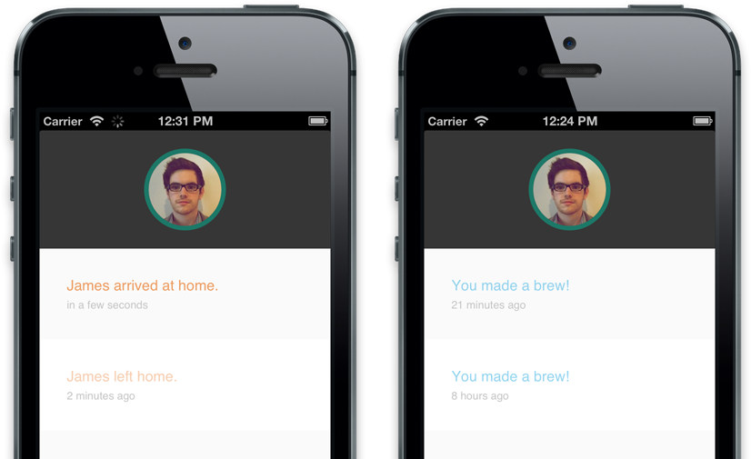

The man component of the brief for this project was to make something that utilises the MQTT Pub/Sub technology and that fits in with the IBM Smarter Planet ethos. 

### Annoyances

Right from the start we decided we didn't want to dive straight into the life and death sensors of the NHS or the mainframes powering entire cities. Looking at a more local scale and solving little problems we encountered on a daily basis is more the direction we wanted to take. Solving the huge problems is great but in our lives everyday there are smaller situations that could be fixed or just made better. Taking our concentration away from these little problems can improve quality of life and allow us to focus on the bigger things.

Flo related a story of being confused when he arrived home to find the front door double locked. Saul had been the last to leave the house and as an extra precaution had secured both locks. An idea was born for an app that displayed if anyone else was in the house so the if you were leaving and no-one else was in you could double lock and if you were returning you would know if it was indeed going to be double locked.

The concept quickly escalated from here, after all if you are making a location aware system for the house why not just give it control of the locks too. Home automation has clearly been done before and there are many technologies already available. However we decided things like remote control curtains, while useful, aren't actually much smarter.

### Mickwitt

MQTT is a technology for sending data between points. Sensors or other sources can send messages along specific channels toward a centralised Broker. The messages are then sorted and sent back out to any point that has requested to 'Subscribe' to that specific channel. The system is designed to be very power and network efficient. It was even chosen by Facebook to be the back-end of their messaging system.

When we started thinking about all the sensors we could spread though our Smarter House we produced ideas for many distinct systems that could be combined to make life easier in many little ways. This fit very well with the IBM concept of a "System of Systems". 

Living in shared housing gave us a different angle on home automation and the problems it could fix. But making dumb systems that simply turned things on and off via basic inputs wasn't enough. The system had to learn and improve itself to fit the lifestyles of the users. 

### The grand plan
  
With the slant of shared housing and automation we designed "Inhabit" a system for a smarter house. The name plays on the concept of each user in the house having their own habits that effect and are effected by the system as a whole. The aim is to increase quality of life, energy efficiency and human empathy between housemates or family members.

The house would have a central server that receives continuos streams of data from all of the house sensors and connected technologies. This server would record all this data and learn from it, building usage models and subsequently controlling the house. This technology is assessable via a customisable web app. The app is designed for screens of all sizes. The two most useful examples we thought were the hallway cork-board replacement screen and the mobile version. The cork-board would be a general access control point and way of seeing a data overview and the mobile version is portable and customised to the specific user.

The system is given power by knowing the location of it's users; whether they are out of the house or what room they are in otherwise. Combining this presence data with the learned historical behaviour and also 'green' best practices, the system attempts to find the perfect balance.

### Potential

By displaying the location and status of your housemates it increases awareness, empathy and utility. By displaying statuses such as "oh his way home", "just gone to sleep" or "about to leave" the system isn't over compensating with GPS coordinates and millisecond time values. Inhabit knows what everyone is doing so can warn you for example if you should be quiet as people are asleep or if you should have a shower now as other people will require it later.

Inhabit controls the heating and lighting in the house on a room by room basis. Setting the house to the perfect temperature it removes the need to fiddle, the potential for argument and even saves energy. The system bases the temperature on user preference, user presence and projected presence, current inside and outside temperatures, 

The lighting is connected to the grand database of knowledge learned over time and alters itself to the sleeping pattern of the user, preparing you for sleep by dimming and changing hue and waking you in the morning with a gentle sunrise effect. The wake-up is timed to your schedule but also will only active when you are in a light sleep cycle. 

Have a shared shopping list across the household and save money by shopping in bulk, automatically arrange the delivery for a time when people are in. Inhabit will automatically charge your accounts based on what you added to the list for yourself and divide the cost of the essentials between everyone.

Simple things like asking everyone if they want a cup of tea when you are making a round can be automated too. Choose the option in the messages menu and it will send out a Yes/No prompt to everyone who is in and awake (and likes tea) and even enable the kettle and fill it the desired amount.

Inhabit can even schedule and divide the few household chores it can't automate, displaying any uncompleted tasks to remind and motivate.

Security can be increased because all of the locks can be enabled all the time unless users are near them and are likely to want access. 

Inhabit also keeps track of bills, and money lending so everyone  always knows how much they owe to the house and to each other. Payments can even me made to other housemates thorough the system.

### Prototype

Sadly we don't have time to create this vastly complex system we have envisioned but hopefully our prototype demonstrates some part of the grand plan. 

<iframe width="708" height="398" src="http://www.youtube.com/embed/alJG27F6YG0?rel=0" frameborder="0" allowfullscreen></iframe>

The mini Inhabit system uses Keychain RFID tags with a reader (standing in as an example door lock) to set the users presence. The tag is read and the data sent to the main server (A node.js version of the MQTT broker) which checks in the specified user. The main server also communicates with the web apps using socket.io to send any changes live as they happen.

When a user arrives home, the prototype will update the current temperature with data of the user's preference loaded from the database powered by MongoDB.

The mobile app currently only represents Ben's version of the app, showing him the status of the other housemates and the history of events without his updates being immediately viewable. The screen can be swiped sideways to filter the events to a specific housemate. Also if Ben arrives home the server will send a message, displayed on in the phone app, if anyone's status is set to asleep. 

The version of the cork-board view currently shows the presence of all 4 users and the projected heating graph alongside the current and updating graph.

There is also a "make tea" button that tell the server to message the other users and also turns on a LED to represent the Kettle Being enabled. 

### Thoughts

This was an interesting project to work on, I liked the closeness of solving very immediate but small problems we face everyday. Evidently IBM thought our plan was grand enough to award us with first place in a contest we didn't know we had entered. We received some IBM branded prizes including a Rubix Cube. I wasn't sure whether I should tell them the stickers were on wrong… 